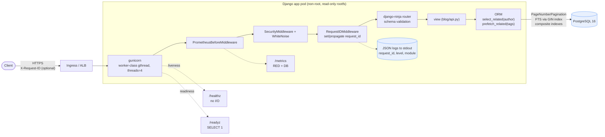
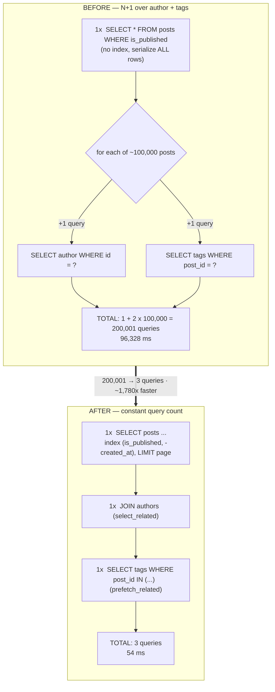
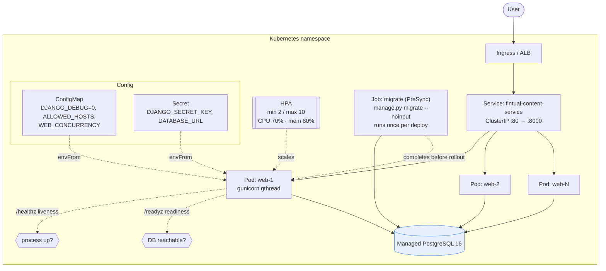
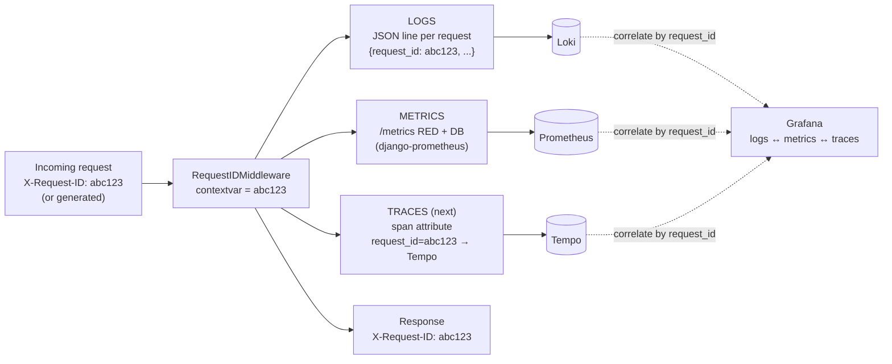

# Architecture

Four views of the same service: how a request flows, why the feed went from 200,001 queries
to 3, how it deploys on Kubernetes, and how one `request_id` ties the telemetry together. All
diagrams are Mermaid and render natively on GitHub.

---

## (a) Component / request flow

A single Django app pod fronted by gunicorn. Every request gets a `request_id`, is measured
by the Prometheus middleware, validated by django-ninja, and served from Postgres with
`select_related` / `prefetch_related` so list endpoints stay at a constant query count.

---

## (b) The N+1 path, before and after

The brief's slowest endpoint. Before: one query for the page, then an author query and a
tag query **per row** over ~100k published posts — 200,001 queries, 96 seconds. After:
`select_related` folds the author into a JOIN, `prefetch_related` fetches all tags in one
`IN (...)` query, and pagination bounds the page — 3 queries, 54 ms, constant in page size.

Measured with the Django test client + `CaptureQueriesContext` over 100k posts / 500k
comments / 1000 users / 50 tags. Raw numbers in [`benchmarks/antes.json`](../benchmarks/antes.json)
and [`benchmarks/despues.json`](../benchmarks/despues.json).

---

## (c) Kubernetes deployment

Migrations run as a **Job** ordered ahead of the rollout (ArgoCD `PreSync` / Helm
`pre-install,pre-upgrade`), never as a per-replica initContainer. The Deployment carries
liveness / readiness / startup probes, resource requests + limits, a non-root read-only
security context, and is scaled by the HPA on CPU + memory.

---

## (d) Observability correlation — one request_id across the signals

`RequestIDMiddleware` reads `X-Request-ID` (or mints one), stores it in a `contextvar`, and
echoes it on the response. The log filter stamps it on every JSON log line; the Prometheus
middleware records RED + DB metrics for the same request; and the same id is the key
OpenTelemetry tracing will reuse once the OTLP exporter is wired (next step). One key ties
logs, metrics, and traces together.

